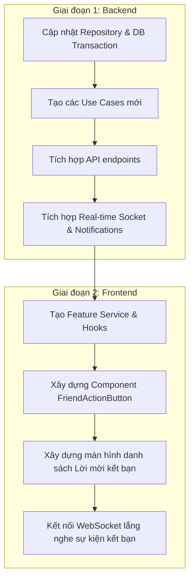

# Kế hoạch Triển khai Tính năng Yêu cầu Kết bạn (Friend Request)

Dựa trên cấu trúc cơ sở dữ liệu (ERD) và thiết kế kiến trúc hiện tại của dự án (Clean Architecture/SOLID), dưới đây là kế hoạch chi tiết để hoàn thiện tính năng **Friend Request** (Yêu cầu kết bạn) đồng bộ giữa cả Backend (BE) và Frontend (FE).

---

## 1. Phân tích Hiện trạng & Đánh giá Gaps (Khoảng trống)

### Backend (BE)
- **Đã có**:
  - Thực thể `Friend` và `FriendRequest`.
  - Interface `IFriendRepository` và `TypeOrmFriendRepository` đã cài đặt các phương thức: `sendFriendRequest`, `acceptFriendRequest`, `declineFriendRequest`, `cancelFriendRequest`, `unfriend`, `getFriends`.
  - Các Use Case tương ứng.
- **Thiếu (Gaps)**:
  1. **API lấy danh sách yêu cầu**: Chưa có endpoint/use-case để lấy danh sách yêu cầu kết bạn đang chờ duyệt (Incoming Pending Requests) và yêu cầu đã gửi (Outgoing Pending Requests).
  2. **Cập nhật Thống kê (`user_stats`)**: Chưa cập nhật tăng/giảm `friend_count` trong bảng `user_stats` khi chấp nhận kết bạn hoặc hủy kết bạn.
  3. **Thông báo thời gian thực (Real-time Notification)**: Chưa tích hợp lưu thông báo vào bảng `notifications` và gửi tín hiệu WebSocket tới người nhận khi có yêu cầu mới hoặc khi yêu cầu được chấp nhận.
  4. **Quan hệ Follow tự động**: Thông thường khi kết bạn, hai người dùng sẽ tự động follow nhau để cập nhật bài viết của nhau lên News Feed (`follows` và `feeds`).

### Frontend (FE)
- **Thiếu**: Chưa có thư mục `features/friends`. Các thành phần UI tương tác như nút "Thêm bạn", tab "Lời mời kết bạn" chưa được triển khai theo SOLID.

---

## 2. Kế hoạch Chi tiết cho Backend (BE)

Áp dụng Clean Architecture và SOLID, ta sẽ mở rộng phân hệ `friends` của BE.

### Bước 2.1: Mở rộng `IFriendRepository` & `TypeOrmFriendRepository`
Bổ sung các phương thức:
```typescript
export interface IFriendRepository {
  // ... các phương thức cũ
  getPendingRequests(userId: string, page: number, limit: number): Promise<any>;
  getSentRequests(userId: string, page: number, limit: number): Promise<any>;
  countPendingRequests(userId: string): Promise<number>;
}
```

### Bước 2.2: Cập nhật logic `acceptFriendRequest` và `unfriend` (Đảm bảo tính nhất quán dữ liệu)
Sử dụng **TypeORM Transactions** để thực hiện đồng thời các tác vụ sau khi kết bạn thành công:
1. Đổi trạng thái `FriendRequest` thành `ACCEPTED`.
2. Tạo 2 bản ghi trong bảng `friends` (mối quan hệ bạn bè 2 chiều).
3. **Tự động Follow**: Tạo 2 bản ghi trong bảng `follows` để hai người dùng tự động follow nhau.
4. **Cập nhật Stats**: Tăng `friend_count`, `follower_count`, `following_count` của cả hai người dùng trong bảng `user_stats`.

### Bước 2.3: Xây dựng Use Cases mới
1. `GetPendingRequestsUseCase`: Lấy các lời mời kết bạn nhận được đang ở trạng thái `PENDING`.
2. `GetSentRequestsUseCase`: Lấy các lời mời kết bạn đã gửi đang ở trạng thái `PENDING`.

### Bước 2.4: Tích hợp Real-time Notifications & WebSocket
1. Khi gửi yêu cầu (`sendFriendRequest`):
   - Tạo một bản ghi thông báo trong bảng `notifications` với payload loại `FRIEND_REQUEST`.
   - Gửi sự kiện Socket qua `ChatGateway` (hoặc một `NotificationGateway` chung) đến `receiverId` để hiển thị badge/pop-up thông báo tức thời.
2. Khi chấp nhận yêu cầu (`acceptFriendRequest`):
   - Tạo bản ghi thông báo loại `FRIEND_ACCEPT`.
   - Gửi sự kiện Socket tương ứng đến `senderId`.

---

## 3. Kế hoạch Chi tiết cho Frontend (FE)

Áp dụng nguyên lý SOLID và phân tách Layer (giống như Stories Feature).

### Bước 3.1: Xây dựng Thư mục `FE/features/friends`
Cấu trúc thư mục chuẩn hóa:
```
FE/features/friends/
├── services/
│   ├── friends.service.ts         # Gọi API và xử lý dữ liệu thô (Single Responsibility)
│   └── dto/                       # Các interface dữ liệu request/response
├── hooks/
│   ├── useFriends.ts              # Custom Hooks dùng React Query để quản lý state & cache
│   └── useFriendRequests.ts
└── components/
    ├── FriendRequestCard.tsx      # Component hiển thị 1 lời mời kết bạn (Chấp nhận / Từ chối)
    ├── FriendRequestList.tsx      # Quản lý danh sách lời mời (dùng Grid/List, phân trang)
    └── FriendActionButton.tsx     # Nút chức năng thông minh dựa trên trạng thái quan hệ
```

### Bước 3.2: Logic của `FriendActionButton` (Nút Hành động Thông minh)
Nút này sẽ hiển thị trên Profile của người dùng khác hoặc trong danh sách tìm kiếm, tự động thay đổi giao diện và hành vi dựa trên quan hệ:
- **Trạng thái `NOT_FRIEND`**: Hiển thị nút "Thêm bạn bè" (khi click -> gọi `sendFriendRequest`).
- **Trạng thái `REQUEST_SENT`**: Hiển thị nút "Hủy yêu cầu" (khi click -> gọi `cancelFriendRequest`).
- **Trạng thái `REQUEST_RECEIVED`**: Hiển thị 2 nút "Chấp nhận" / "Xóa lời mời" (khi click -> gọi `acceptFriendRequest` / `declineFriendRequest`).
- **Trạng thái `FRIENDS`**: Hiển thị nút "Bạn bè" (khi hover hiển thị menu thả xuống có tùy chọn "Hủy kết bạn" -> gọi `unfriend`).

---

## 4. Lộ trình Triển khai (Roadmap)



### Kế hoạch hành động ngay:
1. **Bước tiếp theo**: Tôi sẽ thực hiện nâng cấp Backend (Repository, Transactions, Use Cases, Controller) để hỗ trợ đầy đủ các chức năng này.
2. **Sau đó**: Sẽ tiến hành xây dựng Feature Friends phía Frontend.

Bạn có đồng ý với kế hoạch chi tiết này không? Nếu bạn đồng ý, hãy xác nhận để tôi bắt đầu thực hiện nhé!
